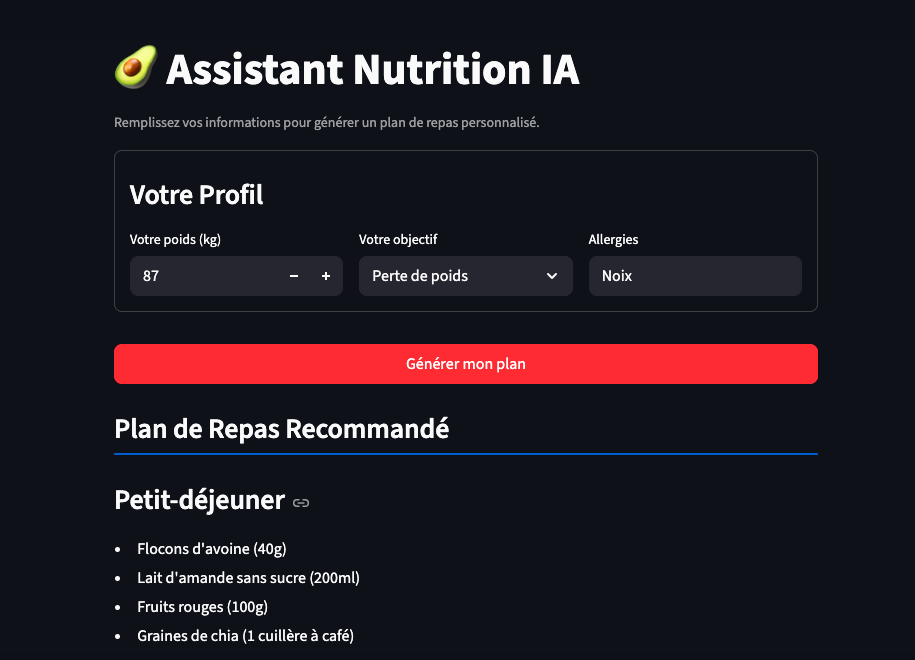

# Assistant Nutrition IA

Application web interactive utilisant Python, Streamlit et l'API Google Gemini pour générer des plans de repas personnalisés.

[](https://projet-nutrition-ia-4bf5merpbasfp2hynv6u3k.streamlit.app/)




---

## 🎯 Objectif du Projet
Ce projet a été développé pour maîtriser le cycle de vie complet d'un produit IA : de l'idée à la production.

L'objectif était de gérer :
* L'intégration d'une API d'IA Générative (Gemini).
* La construction d'une interface utilisateur réactive (Streamlit).
* Le déploiement sur une plateforme cloud (Streamlit Community Cloud).
* Le débogage et l'itération (gestion des erreurs d'API et amélioration du design).

### Fonctionnalités clés
* **Prompt Engineering :** Un prompt dynamique qui s'adapte aux inputs de l'utilisateur.
* **Affichage Dynamique :** La réponse de l'IA est formatée en Markdown propre.
* **Gestion des Erreurs :** Des messages clairs s'affichent si l'API rencontre un problème.

---

## 🛠️ Stack Technique
* **Langage :** Python 3.14
* **Framework Web :** Streamlit
* **Modèle d'IA :** Google Gemini (via API)
* **Bibliothèques :** `google-generativeai`
* **Déploiement :** Streamlit Community Cloud
* **Contrôle de Version :** Git & GitHub

---

## 💻 Installation et Lancement Local

1.  **Clonez le repository** (N'oublie pas de remplacer `VOTRE_NOM_UTILISATEUR`!) :
    ```bash
    git clone [https://github.com/VOTRE_NOM_UTILISATEUR/projet-nutrition-ia.git](https://github.com/VOTRE_NOM_UTILISATEUR/projet-nutrition-ia.git)
    cd projet-nutrition-ia
    ```

2.  **Installez les dépendances :**
    ```bash
    pip install -r requirements.txt
    ```

3.  **Configurez votre clé API :**
    * Créez un dossier `.streamlit`
    * À l'intérieur, créez un fichier `secrets.toml`
    * Ajoutez votre clé : `GOOGLE_API_KEY = "VOTRE_CLE_API_ICI"`

4.  **Lancez l'application :**
    ```bash
    streamlit run app.py
    ```
